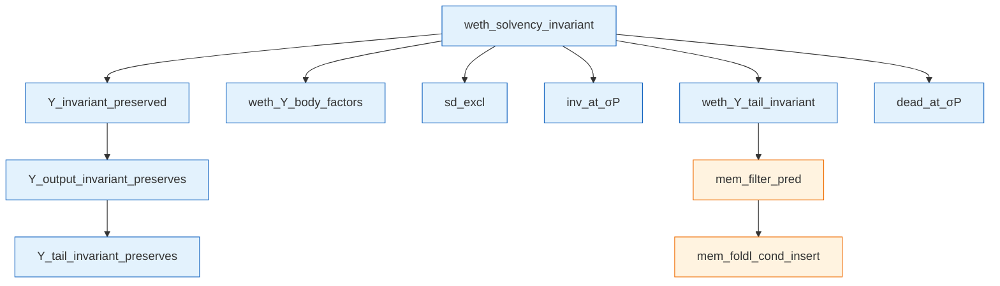

# WETH — what's proved, what's assumed

This report documents the WETH verification on two axes: the
**behavioural spec** (what `deposit` / `withdraw` / the fallback do, as
machine-checked big-step guarantees stated in a small Solidity-style
eDSL) and the **solvency proof** (the global invariant preserved across
any transaction), together with the remaining structural assumptions.

The solvency material is the bulk of this report and comes first; the
behavioural specification and the spec eDSL are documented in their own
section ("Behavioural specification").

## Files of interest

All paths are relative to the `evm-smith` repository root.

- `EvmSmith/Demos/Weth/Spec.lean` — **the spec, as an interface**, and the
  recommended entry point for auditors. A single `structure WethSpec`
  whose fields are WETH's guarantees (the four entry-point behaviours +
  `solvent`), each a short pre/post statement and **no proofs**, plus the
  two `rfl` ABI-decoding bridges. The vocabulary it reads in
  (`balance[·]`, `sender`, `ensures`, `Calls`, `Solvent`, …) lives in the
  eDSL files below.
- `EvmSmith/Demos/Weth/SpecProofs.lean` — the **witness** `weth_spec :
  WethSpec`: one named theorem per guarantee (so each gets its own editor
  checkmark), each a one-line delegation into the engine.
- `EvmSmith/Spec/Dsl.lean` — the **contract-agnostic spec eDSL**: the
  gas-free interpreter `evmRun` / `evmRunToCall`, `Halts`, the `ensures`
  and `before_call` macros and the run accessors (`sender`, `value`,
  `returndata`, `storage`), plus the transaction plumbing (`ExecContext`,
  `runTx`, `afterTx`) and `ethBalance`.
- `EvmSmith/Demos/Weth/SpecDSL.lean` — the **WETH-specific eDSL**: `Entry`,
  `Calls`, the `balance[·]` ledger, `amount`, `untouched (others)`,
  `NoReentrancy`, and the token-solvency vocabulary (`Solvent`,
  `tokenBalanceOf`, `recordedTokenSupply`, the `rfl` bridges).
- `EvmSmith/Demos/Weth/Behaviour.lean` — the **behavioural engine**: the
  storage-readback lemmas, the bytecode-walking routing / `*_from_call`
  theorems, and the big-step `weth_*_run_impl` proofs.
- `EvmSmith/Demos/Weth/Program.lean` — WETH bytecode + decode lemmas.
- `EvmSmith/Demos/Weth/Invariant.lean` — `WethInv` predicate.
- `EvmSmith/Demos/Weth/BytecodeFrame.lean` — trace/walks/cascade machinery.
- `EvmSmith/Demos/Weth/InvariantClosure.lean` — consumer-side
  relational-invariant closure: `StorageSumLeBalance` predicate,
  §H invariant predicates and §H.2 mutual closure, the
  transaction-level entry point `Υ_invariant_preserved` and its
  Υ-tail wrappers. Sits on top of the contract-agnostic framework
  primitives in `EVMYulLean/EvmYul/Frame/`. None of the theorems
  in this file reference WETH's bytecode — the closure is generic
  in shape and lives consumer-side only because we have one
  consumer. Lifting it into `EvmYul/Frame/` as a parametric module
  over `I : AccountMap → AccountAddress → Prop` is a small refactor
  we'll do once a second consumer demonstrates the pattern.
- `EvmSmith/Demos/Weth/Solvency.lean` — top-level theorem.

## What WETH does (in 86 bytes)

A minimal Wrapped-ETH contract:

| Selector | Solidity | Behavior |
|---|---|---|
| `0xd0e30db0` | `deposit() payable` | `balance[msg.sender] += msg.value` |
| `0x2e1a7d4d` | `withdraw(uint256)` | if `balance ≥ x`: decrement + CALL sender x; else revert |

Storage layout: `storage[address(msg.sender)]` holds the user's token
balance in wei. (Address used directly as a `UInt256` slot key — no
mapping-style hashing, deliberate simplification for the proof.)

Safety design:
- `withdraw` updates state **before** the external CALL
  (checks-effects-interactions). Reentrant calls see the
  already-decremented balance.
- No overflow check in `deposit` — `balance + value` wrapping requires
  total deposits to exceed `2^256 − 1` wei, infeasible given total ETH
  supply.

Total bytecode: 86 bytes.

## Behavioural specification: functions as big-steps + a spec eDSL

Solvency (below) is a *global* invariant. Separately we give a
*behavioural* spec: what each entry point actually does to the state,
stated so a smart-contract developer can read it without any Lean-proof
machinery, and proven against the same 86 bytes.

### The interface (`Spec.lean`)

`Spec.lean` is a single structure whose fields *are* the guarantees:

```lean
structure WethSpec where
  deposit : ∀ (s : EVM.State), Calls .deposit s →
    ensures
      balance[sender] = old balance[sender] + value
    ∧ untouched (others)
    ∧ returndata = empty
  withdraw_debits : ∀ (s : EVM.State), Calls .withdraw s →
    amount ≤ old balance[sender] →
    before_call:
      balance[sender] = old balance[sender] - amount
  withdraw : ∀ (s : EVM.State), Calls .withdraw s →
    amount ≤ old balance[sender] → NoReentrancy s →
    ensures
      balance[sender] = old balance[sender] - amount
  fallback : ∀ (s : EVM.State), Calls .unknown s →
    ensures storage = old storage
  solvent : ∀ (ctx : ExecContext) (σ : AccountMap .EVM)
      (tx : Transaction) (S_T weth : Address), …
      SolventAfter ctx σ tx S_T weth
```

No proofs appear here. The witness that WETH's bytecode satisfies every
field is `weth_spec : WethSpec` in `SpecProofs.lean`, where each field is
a named theorem (its own checkmark) discharged by one delegation line.
Because `weth_spec` assigns each `weth_*` theorem to the matching field,
Lean forces the field type and the theorem to agree — the readable
statement cannot drift from what is proven.

### The eDSL

The readable surface is a thin notation layer, split into a
contract-agnostic part (`EvmSmith/Spec/Dsl.lean`) and a WETH part
(`SpecDSL.lean`):

- `Calls e s` bundles the genuine call-entry conditions: pc 0, empty
  stack, WETH's code installed, the account present, and the ABI selector
  equal to `e`'s.
- `ensures Q` is the postcondition of running the contract to its halt.
  It desugars to `∀ {s' o}, Halts s s' o → Q`, where `Halts s s' o` hides
  the interpreter fuel behind `∃ callFuel N, evmRun callFuel N s = some
  (s', o)`.
- inside `Q`, `balance[a]` reads the *post*-state ledger and `old
  balance[a]` the *pre*-state (both at the call's own contract); `sender`
  / `value` / `amount` are `msg.sender` / `msg.value` / the decoded
  argument; `untouched (others)` is the frame condition (every balance
  but the caller's unchanged); `returndata` / `storage` name the run's
  output and post-state account map.
- `before_call: Q` is the same idea at the point of the outbound `CALL`
  (`∀ {s'}, ReachesCall s s' → Q`).

These are ordinary `def`s plus a handful of `notation`s and two `macro`s.
The `s`/`s'`/`o` names are captured by convention (`set_option hygiene
false`), which is the one bit of notation magic; everything else is
standard Lean. Auditing or changing the surface means reading ~150 lines
of definitions, not proof terms.

### The gas-free interpreter

`Halts` / `ReachesCall` run the contract through `evmRun` / `evmRunToCall`:
iterate the real `EVM.step`, decoding each instruction from the
contract's own code at the current pc, until a halt (resp. until just
before the first `CALL`). This is the EVM's frame loop `EVM.X` **with gas
ignored** (`gasCost = 0`, ample step fuel) — the single modelling
assumption of the behavioural layer. Every opcode's effect is the real
semantics; only gas accounting and fuel-bounded halt detection are
abstracted. (The genuine `EVM.X` form additionally needs the framework's
gas/halt fuel-induction, an open obligation in `XFrame.lean`.)

### The big-step proofs

Each `weth_*_run_impl` (in `Behaviour.lean`) extracts the per-instruction
`EVM.step` facts from a single `evmRun … = some (s', o)` hypothesis,
threading the pc and stack through the dispatch and the function body
(~15–40 steps), then feeds them to the routing / `*_from_call` delta
theorems already used by the solvency walk. So one hypothesis ("the
contract ran to halt") yields the entire state delta and the return data,
with the instruction chain hidden inside the proof.

### Reentrancy: what is conditional, what is not

`withdraw` writes its decrement *before* the external `CALL`
(checks-effects-interactions), which is exactly why three different
statements hold with different strength:

- `withdraw_debits` (**unconditional**): by the time withdraw makes its
  `CALL`, the caller is already debited by exactly `x`. No reentrancy
  hypothesis — this is the contract's own effect, before any external
  code runs.
- `solvent` (**unconditional**, below): the contract stays
  collateralised even against arbitrary reentering recipients — a
  reentrant `withdraw` sees the already-decremented balance and the `LT`
  gate blocks over-withdrawal.
- `withdraw` (**conditional**): the *exact end-balance* `old − x` after
  the whole run needs `NoReentrancy s`. A recipient that reenters and
  deposits/withdraws would change the final figure, so the precise
  number is conditional. `NoReentrancy s` says the `CALL` step does not
  change the caller's recorded balance; it holds vacuously for a codeless
  (EOA) recipient and guards only this exact figure, never safety.

### ABI decoding: closing the gap to the compiler

`Calls .f` matches on `functionSelector calldata`, and `amount` is
`withdrawArg`. Two `rfl` bridges (in `Spec.lean`) pin these to the exact
EVM operations the Solidity compiler emits for ABI dispatch and decoding:

```lean
theorem selector_is_abi (s) :
    functionSelector s.executionEnv.calldata
      = UInt256.shiftRight (calldataload s 0) (UInt256.ofNat 0xe0)   -- shr(224, calldataload(0))

theorem withdraw_arg_is_abi (s) :
    withdrawArg s = calldataload s (UInt256.ofNat 4)                 -- calldataload(4)
```

So the spec's "selector" and "argument" are, by construction, the
selector extraction (`shr(224, calldataload(0))`) and the `uint256` load
(`calldataload(4)`) the compiler generates. The remaining abstract
identity — that `shr(224, ·)` of the first word equals the leading 4
bytes `calldata[0:4]`, and `calldataload(4)` the slice `calldata[4:36]` —
is the EVM semantics of `SHR` / `CALLDATALOAD`; we take it as the meaning
of those opcodes rather than re-deriving it through the byte-array
primitives (`readBytes` / `copySlice` are opaque).

### Trust / axioms (behavioural layer)

The four behavioural theorems and the `weth_spec` witness depend only on
the standard axioms (`propext`, `Classical.choice`, `Quot.sound`,
`Lean.ofReduceBool`); no `sorry`, no contract-specific axiom. What the
behavioural layer abstracts rather than proves: gas accounting (the
gas-free interpreter), the `NoReentrancy` assumption on `withdraw`'s exact
figure, and the abstract ABI byte-identity noted above.

## The headline invariant

```lean
def WethInv (σ : AccountMap .EVM) (C : AccountAddress) : Prop :=
  storageSum σ C ≤ balanceOf σ C
```

In English: **the sum of all stored token balances at WETH's address
is at most WETH's actual ETH balance**.

This is a *relational* invariant about σ — not bytecode-specific.
`storageSum σ C` sums every slot's value at C's storage. `balanceOf σ C`
is C's actual ETH balance.

## The headline theorem

```lean
theorem weth_solvency_invariant
    (fuel : ℕ) (σ : AccountMap .EVM) (H_f : ℕ)
    (H H_gen : BlockHeader) (blocks : ProcessedBlocks)
    (tx : Transaction) (S_T C : AccountAddress)
    (hWF : StateWF σ)
    (hInv : WethInv σ C)
    (hS_T : C ≠ S_T)
    (hBen : C ≠ H.beneficiary)
    (_hValid : TxValid σ S_T tx H H_f)
    (hAssumptions : WethAssumptions σ fuel H_f H H_gen blocks tx S_T C) :
    match EVM.Υ fuel σ H_f H H_gen blocks tx S_T with
    | .ok (σ', _, _, _) => WethInv σ' C
    | .error _ => True
```

In English: **for any well-formed pre-state σ that already satisfies
WETH's invariant, after running any transaction through the EVM's Υ
function, the post-state σ' still satisfies WETH's invariant** (or
the transaction errored, in which case the conclusion is vacuous).

The pre-state hypotheses (`hWF`, `hInv`, `hS_T`, `hBen`, `_hValid`)
are standard transaction-level facts: state well-formedness, the
invariant we're preserving, the contract isn't the transaction
sender or block beneficiary, and the transaction is valid.

`hAssumptions : WethAssumptions ...` packages 5 structural facts —
detailed below.

## Main theorems and lemmas (all proved)

### Cascade-fact predicates → theorems

The "interesting" proof bits — three predicates that capture per-PC
structural data needed by WETH's three on-chain effects (two SSTOREs
and one CALL). Originally opaque; now all three are theorems.

| Theorem | What it says |
|---|---|
| `weth_pc60_cascade : WethAccountAtC C → WethPC60CascadeFacts C` | At any reachable PC 60 (withdraw's SSTORE), the trace exposes `(slot, oldVal, newVal=oldVal-x, x)` with `x ≤ oldVal`. |
| `weth_pc40_cascade : WethDepositCascadeStruct C → WethDepositPreCredit C → WethPC40CascadeFacts C` | At PC 40 (deposit's SSTORE): stack shape + slot/value witness + Θ-pre-credit slack. |
| `weth_pc72_cascade : WethCallNoWrapAt72 C → WethCallSlackAt72 C → WethPC72CascadeFacts C` | At PC 72 (withdraw's CALL): seven CALL-args + recipient no-wrap + caller funds + slack. |

### Per-state σ-has-C theorem

```lean
theorem weth_account_at_C : WethAccountAtC C
```

For any WETH-reachable state, `σ.find? C = some _`. Proved by adding
`accountPresentAt s.accountMap C` as a conjunct of `WethReachable` and
showing every per-PC walk preserves it.

### Cascade-threading theorems (deposit and withdraw)

```lean
theorem weth_deposit_cascade : WethDepositCascadeStruct C
theorem weth_call_slack : WethCallSlackAt72 C
```

These thread structural data through the bytecode's PC trace:

- **Deposit** (PCs 32→40, 8 instructions): tracks `(slot, oldVal,
  newVal, msg.value)` from CALLER push through ADD into SSTORE.

- **Withdraw SSTORE** (PCs 47→60, 13 instructions): tracks `(slot,
  oldVal, x, bound x ≤ oldVal)` from DUP1 through LT/JUMPI gate to
  the SSTORE write.

- **Withdraw CALL** (PCs 60→72, 8 more instructions): tracks
  post-SSTORE slack `x + storageSum σ C ≤ balanceOf σ C` from PC 60
  through CALL setup.

Each PC's WethTrace disjunct carries the relevant state (stack shape +
storage facts + invariant ≤). Each per-PC walk transitions one
disjunct's data to the next.

### Step-preservation theorems

```lean
theorem weth_xi_preserves_C : ΞPreservesAccountAt C
theorem weth_xi_preserves_C_other  -- universal Ξ-preservation
theorem weth_call_inv_step_pres   -- CALL-step StorageSumLeBalance preservation
theorem weth_step_closure : WethStepClosure C
```

These prove that WETH's reachability and invariants are preserved
across single EVM steps and across nested CALLs.

### The reachability predicate

```lean
private def WethReachable (C : AccountAddress) (s : EVM.State) : Prop :=
  WethTrace C s ∧ ¬ (s.pc.toNat = 32 ∧ s.stack.length = 0) ∧
  accountPresentAt s.accountMap C ∧
  StorageSumLeBalance s.accountMap C
```

Four conjuncts: (1) the trace predicate carrying per-PC structural
data, (2) exclusion of a vacuous post-halt state, (3) σ has C, (4) the
invariant. Proved preserved by every Weth opcode's per-PC walk via
`weth_step_closure`.

### Bytecode trace predicate

```lean
private def WethTrace (C : AccountAddress) (s : EVM.State) : Prop
```

A 64-disjunct predicate enumerating every reachable `(pc, stack-length,
+ structural data)` combination during WETH's execution. Each disjunct
captures what's known about the stack, storage, and invariants at that
PC.

The trace was extended significantly during the proof:
- PC 47 carries DUP1's invariant `stack[0]? = stack[1]?`.
- PCs 49–60 carry the withdraw cascade's `(slot, oldVal, x, bound)`.
- PCs 56–60 additionally carry `x ≤ oldVal` (from JUMPI not-taken).
- PCs 36–40 carry the deposit cascade's `(slot, oldVal, newVal)`.
- PCs 61–72 carry the post-SSTORE slack `x + storageSum ≤ balanceOf`.

### The X-loop closure aggregate

```lean
theorem weth_step_closure : WethStepClosure C
```

A single theorem aggregating ~61 per-PC walks. For any WETH-reachable
state and any non-halt EVM step, the post-state is also
WETH-reachable. Discharged by case-analysis on the trace's PC
disjunct + invocation of the per-PC walk theorem.

## Theorem call graphs

Two complementary graphs render the proof's dependency structure.
Generated by `lake exe weth-call-graph <theorem-name> [<max-depth>]`
walking each theorem's proof term and emitting Mermaid (filtering to
theorems/axioms in `EvmYul.Frame`, `EvmSmith.Demos.Weth`, and
`EvmSmith.Lemmas`; non-theorem nodes are skipped through). Re-run to
refresh after proof edits.

### Top-level wiring (depth 3 from `weth_solvency_invariant`)



`weth_solvency_invariant` is a thin wrapper: it composes the
consumer-side `Υ_invariant_preserved` (in
`EvmSmith/Demos/Weth/InvariantClosure.lean`) with two demo-side
factorisations (`weth_Υ_body_factors`, `weth_Υ_tail_invariant`) and
threads three fields of `WethAssumptions`. The
`Υ_invariant_preserved` chain itself, including
`Υ_output_invariant_preserves` and `Υ_tail_invariant_preserves`,
lives consumer-side too — the framework only carries the
balance-monotonicity entry-point analogue (`Υ_balanceOf_ge`) and
the generic Υ-tail helpers both chains share. (Mermaid node IDs
retain the `EvmYul_Frame_*` prefix because the Lean namespace was
kept as `EvmYul.Frame` for diff minimality during the extraction;
the class name is the source of truth for framework-vs-consumer
classification.) The interesting bytecode content lives in the
second graph.

### Bytecode walk (depth 2 from `bytecodePreservesInvariant_inv_aware_fully_narrowed`)

```mermaid
graph TD
  EvmSmith_Weth_bytecodePreservesInvariant_inv_aware_fully_narrowed["bytecodePreservesInvariant_inv_aware_fully_narrowed"]:::weth
  EvmSmith_Weth_bytecodePreservesInvariant_inv_aware["bytecodePreservesInvariant_inv_aware"]:::weth
  EvmSmith_Weth_weth_pc72_cascade["weth_pc72_cascade"]:::weth
  EvmSmith_Weth_weth_sstore_preserves_from_cascades["weth_sstore_preserves_from_cascades"]:::weth
  EvmSmith_Weth_weth_pc40_cascade["weth_pc40_cascade"]:::weth
  EvmSmith_Weth_weth_call_slack_from_cascade["weth_call_slack_from_cascade"]:::weth
  EvmSmith_Weth_weth_pc60_cascade["weth_pc60_cascade"]:::weth
  EvmSmith_Weth_weth_account_at_C["weth_account_at_C"]:::weth
  EvmSmith_Weth_weth_call_slack["weth_call_slack"]:::weth
  EvmSmith_Weth_weth_deposit_cascade["weth_deposit_cascade"]:::weth
  EvmSmith_Weth_WethReachable_initial["WethReachable_initial"]:::weth
  EvmSmith_Weth_WethReachable_decodeSome["WethReachable_decodeSome"]:::weth
  EvmYul_Frame_EVM_step_preserves_present_no_create["EVM_step_preserves_present_no_create"]:::frame
  EvmYul_Frame_ΞPreservesInvariantAtC_of_Reachable_general_call_slack_dispatch_inv_aware["ΞPreservesInvariantAtC_of_Reachable_general_call_slack_dispatch_inv_aware"]:::weth
  EvmSmith_Weth_WethReachable_Z_preserves["WethReachable_Z_preserves"]:::weth
  EvmSmith_Weth_WethReachable_op_in_allowed["WethReachable_op_in_allowed"]:::weth
  EvmSmith_Weth_WethOpAllowed_discharge["WethOpAllowed_discharge"]:::weth
  EvmSmith_Weth_weth_no_create["weth_no_create"]:::weth
  EvmSmith_Weth_weth_step_closure_with_pres_inv_aware["weth_step_closure_with_pres_inv_aware"]:::weth
  EvmSmith_Weth_weth_sstore_preserves_pc60_from_cascade["weth_sstore_preserves_pc60_from_cascade"]:::weth
  EvmSmith_Weth_weth_sstore_preserves_pc40_from_cascade["weth_sstore_preserves_pc40_from_cascade"]:::weth
  EvmSmith_Weth_WethReachable_sstore_pc["WethReachable_sstore_pc"]:::weth
  EvmSmith_Weth_WethReachable_call_pc["WethReachable_call_pc"]:::weth
  EvmSmith_Weth_decode_bytecode_at_72["decode_bytecode_at_72"]:::weth
  EvmSmith_Weth_pc_eq_ofNat_of_toNat["pc_eq_ofNat_of_toNat"]:::weth
  EvmYul_Frame_UInt256_sub_toNat_of_le["UInt256_sub_toNat_of_le"]:::frame
  EvmSmith_Weth_WethReachable_pc60_cascade["WethReachable_pc60_cascade"]:::weth
  EvmSmith_Weth_WethReachable_pc72_slack["WethReachable_pc72_slack"]:::weth
  EvmSmith_Weth_WethReachable_pc40_cascade["WethReachable_pc40_cascade"]:::weth
  EvmSmith_Weth_bytecodePreservesInvariant_inv_aware_fully_narrowed --> EvmSmith_Weth_bytecodePreservesInvariant_inv_aware
  EvmSmith_Weth_bytecodePreservesInvariant_inv_aware_fully_narrowed --> EvmSmith_Weth_weth_pc72_cascade
  EvmSmith_Weth_bytecodePreservesInvariant_inv_aware_fully_narrowed --> EvmSmith_Weth_weth_sstore_preserves_from_cascades
  EvmSmith_Weth_bytecodePreservesInvariant_inv_aware_fully_narrowed --> EvmSmith_Weth_weth_pc40_cascade
  EvmSmith_Weth_bytecodePreservesInvariant_inv_aware_fully_narrowed --> EvmSmith_Weth_weth_call_slack_from_cascade
  EvmSmith_Weth_bytecodePreservesInvariant_inv_aware_fully_narrowed --> EvmSmith_Weth_weth_pc60_cascade
  EvmSmith_Weth_bytecodePreservesInvariant_inv_aware_fully_narrowed --> EvmSmith_Weth_weth_account_at_C
  EvmSmith_Weth_bytecodePreservesInvariant_inv_aware_fully_narrowed --> EvmSmith_Weth_weth_call_slack
  EvmSmith_Weth_bytecodePreservesInvariant_inv_aware_fully_narrowed --> EvmSmith_Weth_weth_deposit_cascade
  EvmSmith_Weth_bytecodePreservesInvariant_inv_aware --> EvmSmith_Weth_WethReachable_initial
  EvmSmith_Weth_bytecodePreservesInvariant_inv_aware --> EvmSmith_Weth_WethReachable_decodeSome
  EvmSmith_Weth_bytecodePreservesInvariant_inv_aware --> EvmYul_Frame_EVM_step_preserves_present_no_create
  EvmSmith_Weth_bytecodePreservesInvariant_inv_aware --> EvmYul_Frame_ΞPreservesInvariantAtC_of_Reachable_general_call_slack_dispatch_inv_aware
  EvmSmith_Weth_bytecodePreservesInvariant_inv_aware --> EvmSmith_Weth_WethReachable_Z_preserves
  EvmSmith_Weth_bytecodePreservesInvariant_inv_aware --> EvmSmith_Weth_WethReachable_op_in_allowed
  EvmSmith_Weth_bytecodePreservesInvariant_inv_aware --> EvmSmith_Weth_WethOpAllowed_discharge
  EvmSmith_Weth_bytecodePreservesInvariant_inv_aware --> EvmSmith_Weth_weth_no_create
  EvmSmith_Weth_bytecodePreservesInvariant_inv_aware --> EvmSmith_Weth_weth_step_closure_with_pres_inv_aware
  EvmSmith_Weth_weth_sstore_preserves_from_cascades --> EvmSmith_Weth_weth_sstore_preserves_pc60_from_cascade
  EvmSmith_Weth_weth_sstore_preserves_from_cascades --> EvmSmith_Weth_weth_sstore_preserves_pc40_from_cascade
  EvmSmith_Weth_weth_sstore_preserves_from_cascades --> EvmSmith_Weth_WethReachable_sstore_pc
  EvmSmith_Weth_weth_call_slack_from_cascade --> EvmSmith_Weth_WethReachable_call_pc
  EvmSmith_Weth_weth_call_slack_from_cascade --> EvmSmith_Weth_decode_bytecode_at_72
  EvmSmith_Weth_weth_call_slack_from_cascade --> EvmSmith_Weth_pc_eq_ofNat_of_toNat
  EvmSmith_Weth_weth_pc60_cascade --> EvmYul_Frame_UInt256_sub_toNat_of_le
  EvmSmith_Weth_weth_pc60_cascade --> EvmSmith_Weth_WethReachable_pc60_cascade
  EvmSmith_Weth_weth_call_slack --> EvmSmith_Weth_WethReachable_pc72_slack
  EvmSmith_Weth_weth_deposit_cascade --> EvmSmith_Weth_WethReachable_pc40_cascade
  classDef weth fill:#e3f2fd,stroke:#1565c0;
  classDef frame fill:#fff3e0,stroke:#ef6c00;
```



`bytecodePreservesInvariant_inv_aware_fully_narrowed` discharges
`ΞPreservesInvariantAtC C` from the consumer-side
`_inv_aware`-slack-dispatch entry point (in
`EvmSmith/Demos/Weth/InvariantClosure.lean`; the framework only
contributes the underlying pres-step pieces in §J.6.6/.6.7), the
three cascade theorems (`weth_pc{40,60,72}_cascade`), and the
per-PC walks aggregated under
`weth_step_closure_with_pres_inv_aware`. Each
cascade theorem in turn extracts its data from the corresponding
`WethReachable_pc{40,60,72}_cascade` predicate disjunct of the
trace. (This theorem is no longer threaded through
`weth_solvency_invariant` — `Υ_invariant_preserved` was simplified
to drop the witness parameter — but the theorem still ships as a
standalone result for any consumer that wants a fully-discharged
`ΞPreservesInvariantAtC C`.)

## What's still assumed (5 fields)

```lean
structure WethAssumptions ... : Prop where
  deployed         : DeployedAtC C
  sd_excl          : WethSDExclusion ...
  dead_at_σP       : WethDeadAtσP ...
  inv_at_σP        : WethInvAtσP ...
  call_no_wrap     : WethCallNoWrapAt72 C
```

### Standard boundary facts (4)

These are the standard real-world / chain-state hypotheses any
single-contract proof of this shape needs.

#### `deployed : DeployedAtC C`

In English: **WETH's bytecode is installed at address C**.

Real-world basis: a contract was deployed to address C at genesis or
in some prior block, and that deployment installed WETH's specific
86-byte bytecode. WETH's bytecode contains no CREATE/CREATE2/
SELFDESTRUCT, so the code at C is preserved across any sub-frame.

#### `sd_excl : WethSDExclusion ...`

In English: **no SELFDESTRUCT in the call tree adds C to the
self-destruct set**.

Real-world basis: SELFDESTRUCT only inserts the executing-frame
address into the SD-set. WETH's bytecode has no SELFDESTRUCT. By
`deployed`, only WETH's code runs at C, so no SELFDESTRUCT can target
C as the executing-frame.

#### `dead_at_σP : WethDeadAtσP ...`

In English: **after Θ/Λ dispatch but before the tail step, σ_P has
`dead σ_P C = false`** — i.e., C still has non-empty code.

Real-world basis: WETH's invariant maintenance preserves C's code
identity through value-debit and CREATE-derivation rules.

> Both `sd_excl` and `dead_at_σP` are caller-supplied hypotheses
> today. The framework's paused Phase A — see "Open work" in
> [`EVMYulLean/FRAME_LIBRARY.md`](https://github.com/leonardoalt/EVMYulLean/blob/main/FRAME_LIBRARY.md)
> — would internalise both by adding a fourth conjunct
> (substate-level SD-set tracking) to the at-C frame predicates.
> The leaf infrastructure landed; the parallel rewrite of the
> closure proofs that would tie it together is the part that
> stalled.

#### `inv_at_σP : WethInvAtσP ...`

In English: **the post-Θ/Λ-dispatch state σ_P satisfies WETH's
invariant** — `storageSum σ_P C ≤ balanceOf σ_P C`.

Real-world basis: this is the σ-to-σ_P propagation step.
Discharging from Lean requires exposed `Θ_invariant_preserved` /
`Λ_invariant_preserved` theorems (consumer-side, in
`EvmSmith/Demos/Weth/InvariantClosure.lean`).

### Genuinely irreducible chain bound (1)

#### `call_no_wrap : WethCallNoWrapAt72 C`

In English: **at WETH's outbound CALL (PC 72), the recipient's
balance plus the value being transferred is < 2^256**.

Real-world basis: the total ETH supply on-chain plus any single
contract's balance fits in `UInt256`. The EVM's UInt256 arithmetic
guarantees this for actual chain state — but it's not derivable from
WETH's bytecode or from EVM semantics alone. It's a fact about
chain-state bounds.

This is the only assumption in `WethAssumptions` that's specific to
the contract's behaviour: WETH's `withdraw` does an external CALL
with non-zero value, so we need a chain-state bound on what
arithmetic that CALL can perform.

## Trust boundary

To trust the WETH solvency theorem, you trust:

1. **Lean's type checker** — that the proof compiles.
2. **The EVMYulLean framework** — that the formalization of EVM
   semantics matches the actual EVM. The framework has 2 axioms (T2,
   T5) marking deferred parts of the spec; otherwise it's a
   first-principles formalization.
3. **The 5 `WethAssumptions` fields** — 4 standard
   transaction-boundary facts + 1 chain-state bound.

That's it. There are zero opaque "the bytecode does what we think it
does" predicates left.

## What's NOT assumed (this is the point)

Originally, the proof had 3 opaque cascade-fact predicates that
amounted to "the bytecode behaves correctly at PCs 40, 60, 72". These
were essentially the entire interesting part of the proof.

All three are now Lean theorems mechanically verified by Lean's type
checker. The proof walks instruction-by-instruction through WETH's 86
bytes and tracks what each instruction does to the EVM state at the
proposition level.

If you change any byte of the bytecode, the proof breaks (decode
lemmas fail). The proof is a tight binding between the bytecode and
its claimed safety property.
