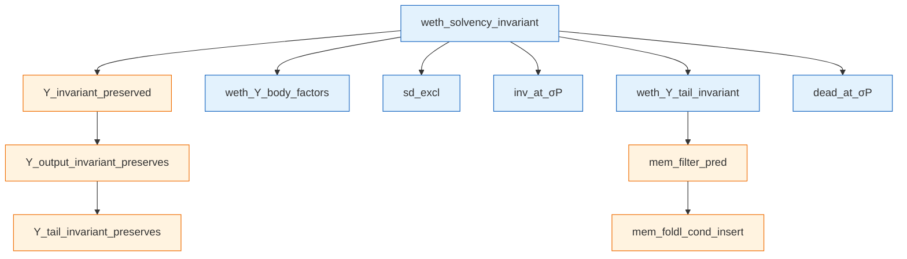

# WETH solvency proof — what's proved, what's assumed

This report documents the WETH solvency proof, its main theorems and
lemmas, and the remaining structural assumptions.

## Files of interest

All paths are relative to the `evm-smith` repository root.

- `EvmSmith/Demos/Weth/Program.lean` — WETH bytecode + decode lemmas.
- `EvmSmith/Demos/Weth/Invariant.lean` — `WethInv` predicate.
- `EvmSmith/Demos/Weth/BytecodeFrame.lean` — trace/walks/cascade machinery.
- `EvmSmith/Demos/Weth/Solvency.lean` — top-level theorem.

## What WETH does (in 86 bytes)

A minimal Wrapped-ETH contract:

| Selector | Solidity | Behavior |
|---|---|---|
| `0xd0e30db0` | `deposit() payable` | `balance[msg.sender] += msg.value` |
| `0x2e1a7d4d` | `withdraw(uint256)` | if `balance ≥ x`: decrement + CALL sender x; else revert |

Storage layout: `storage[address(msg.sender)]` holds the user's token
balance in wei. (Address used directly as a `UInt256` slot key — no
mapping-style hashing, deliberate simplification for the proof.)

Safety design:
- `withdraw` updates state **before** the external CALL
  (checks-effects-interactions). Reentrant calls see the
  already-decremented balance.
- No overflow check in `deposit` — `balance + value` wrapping requires
  total deposits to exceed `2^256 − 1` wei, infeasible given total ETH
  supply.

Total bytecode: 86 bytes.

## The headline invariant

```lean
def WethInv (σ : AccountMap .EVM) (C : AccountAddress) : Prop :=
  storageSum σ C ≤ balanceOf σ C
```

In English: **the sum of all stored token balances at WETH's address
is at most WETH's actual ETH balance**.

This is a *relational* invariant about σ — not bytecode-specific.
`storageSum σ C` sums every slot's value at C's storage. `balanceOf σ C`
is C's actual ETH balance.

## The headline theorem

```lean
theorem weth_solvency_invariant
    (fuel : ℕ) (σ : AccountMap .EVM) (H_f : ℕ)
    (H H_gen : BlockHeader) (blocks : ProcessedBlocks)
    (tx : Transaction) (S_T C : AccountAddress)
    (hWF : StateWF σ)
    (hInv : WethInv σ C)
    (hS_T : C ≠ S_T)
    (hBen : C ≠ H.beneficiary)
    (_hValid : TxValid σ S_T tx H H_f)
    (hAssumptions : WethAssumptions σ fuel H_f H H_gen blocks tx S_T C) :
    match EVM.Υ fuel σ H_f H H_gen blocks tx S_T with
    | .ok (σ', _, _, _) => WethInv σ' C
    | .error _ => True
```

In English: **for any well-formed pre-state σ that already satisfies
WETH's invariant, after running any transaction through the EVM's Υ
function, the post-state σ' still satisfies WETH's invariant** (or
the transaction errored, in which case the conclusion is vacuous).

The pre-state hypotheses (`hWF`, `hInv`, `hS_T`, `hBen`, `_hValid`)
are standard transaction-level facts: state well-formedness, the
invariant we're preserving, the contract isn't the transaction
sender or block beneficiary, and the transaction is valid.

`hAssumptions : WethAssumptions ...` packages 5 structural facts —
detailed below.

## Main theorems and lemmas (all proved)

### Cascade-fact predicates → theorems

The "interesting" proof bits — three predicates that capture per-PC
structural data needed by WETH's three on-chain effects (two SSTOREs
and one CALL). Originally opaque; now all three are theorems.

| Theorem | What it says |
|---|---|
| `weth_pc60_cascade : WethAccountAtC C → WethPC60CascadeFacts C` | At any reachable PC 60 (withdraw's SSTORE), the trace exposes `(slot, oldVal, newVal=oldVal-x, x)` with `x ≤ oldVal`. |
| `weth_pc40_cascade : WethDepositCascadeStruct C → WethDepositPreCredit C → WethPC40CascadeFacts C` | At PC 40 (deposit's SSTORE): stack shape + slot/value witness + Θ-pre-credit slack. |
| `weth_pc72_cascade : WethCallNoWrapAt72 C → WethCallSlackAt72 C → WethPC72CascadeFacts C` | At PC 72 (withdraw's CALL): seven CALL-args + recipient no-wrap + caller funds + slack. |

### Per-state σ-has-C theorem

```lean
theorem weth_account_at_C : WethAccountAtC C
```

For any WETH-reachable state, `σ.find? C = some _`. Proved by adding
`accountPresentAt s.accountMap C` as a conjunct of `WethReachable` and
showing every per-PC walk preserves it.

### Cascade-threading theorems (deposit and withdraw)

```lean
theorem weth_deposit_cascade : WethDepositCascadeStruct C
theorem weth_call_slack : WethCallSlackAt72 C
```

These thread structural data through the bytecode's PC trace:

- **Deposit** (PCs 32→40, 8 instructions): tracks `(slot, oldVal,
  newVal, msg.value)` from CALLER push through ADD into SSTORE.

- **Withdraw SSTORE** (PCs 47→60, 13 instructions): tracks `(slot,
  oldVal, x, bound x ≤ oldVal)` from DUP1 through LT/JUMPI gate to
  the SSTORE write.

- **Withdraw CALL** (PCs 60→72, 8 more instructions): tracks
  post-SSTORE slack `x + storageSum σ C ≤ balanceOf σ C` from PC 60
  through CALL setup.

Each PC's WethTrace disjunct carries the relevant state (stack shape +
storage facts + invariant ≤). Each per-PC walk transitions one
disjunct's data to the next.

### Step-preservation theorems

```lean
theorem weth_xi_preserves_C : ΞPreservesAccountAt C
theorem weth_xi_preserves_C_other  -- universal Ξ-preservation
theorem weth_call_inv_step_pres   -- CALL-step WethInvFr preservation
theorem weth_step_closure : WethStepClosure C
```

These prove that WETH's reachability and invariants are preserved
across single EVM steps and across nested CALLs.

### The reachability predicate

```lean
private def WethReachable (C : AccountAddress) (s : EVM.State) : Prop :=
  WethTrace C s ∧ ¬ (s.pc.toNat = 32 ∧ s.stack.length = 0) ∧
  accountPresentAt s.accountMap C ∧
  WethInvFr s.accountMap C
```

Four conjuncts: (1) the trace predicate carrying per-PC structural
data, (2) exclusion of a vacuous post-halt state, (3) σ has C, (4) the
invariant. Proved preserved by every Weth opcode's per-PC walk via
`weth_step_closure`.

### Bytecode trace predicate

```lean
private def WethTrace (C : AccountAddress) (s : EVM.State) : Prop
```

A 64-disjunct predicate enumerating every reachable `(pc, stack-length,
+ structural data)` combination during WETH's execution. Each disjunct
captures what's known about the stack, storage, and invariants at that
PC.

The trace was extended significantly during the proof:
- PC 47 carries DUP1's invariant `stack[0]? = stack[1]?`.
- PCs 49–60 carry the withdraw cascade's `(slot, oldVal, x, bound)`.
- PCs 56–60 additionally carry `x ≤ oldVal` (from JUMPI not-taken).
- PCs 36–40 carry the deposit cascade's `(slot, oldVal, newVal)`.
- PCs 61–72 carry the post-SSTORE slack `x + storageSum ≤ balanceOf`.

### The X-loop closure aggregate

```lean
theorem weth_step_closure : WethStepClosure C
```

A single theorem aggregating ~61 per-PC walks. For any WETH-reachable
state and any non-halt EVM step, the post-state is also
WETH-reachable. Discharged by case-analysis on the trace's PC
disjunct + invocation of the per-PC walk theorem.

## Theorem call graphs

Two complementary graphs render the proof's dependency structure.
Generated by `lake exe weth-call-graph <theorem-name> [<max-depth>]`
walking each theorem's proof term and emitting Mermaid (filtering to
theorems/axioms in `EvmYul.Frame`, `EvmSmith.Demos.Weth`, and
`EvmSmith.Lemmas`; non-theorem nodes are skipped through). Re-run to
refresh after proof edits.

### Top-level wiring (depth 3 from `weth_solvency_invariant`)



`weth_solvency_invariant` is a thin wrapper: it composes the
framework's `Υ_invariant_preserved` with two demo-side
factorisations (`weth_Υ_body_factors`, `weth_Υ_tail_invariant`) and
threads three fields of `WethAssumptions`. The interesting bytecode
content lives in the second graph.

### Bytecode walk (depth 2 from `bytecodePreservesInvariant_inv_aware_fully_narrowed`)

```mermaid
graph TD
  EvmSmith_Weth_bytecodePreservesInvariant_inv_aware_fully_narrowed["bytecodePreservesInvariant_inv_aware_fully_narrowed"]:::weth
  EvmSmith_Weth_bytecodePreservesInvariant_inv_aware["bytecodePreservesInvariant_inv_aware"]:::weth
  EvmSmith_Weth_weth_pc72_cascade["weth_pc72_cascade"]:::weth
  EvmSmith_Weth_weth_sstore_preserves_from_cascades["weth_sstore_preserves_from_cascades"]:::weth
  EvmSmith_Weth_weth_pc40_cascade["weth_pc40_cascade"]:::weth
  EvmSmith_Weth_weth_call_slack_from_cascade["weth_call_slack_from_cascade"]:::weth
  EvmSmith_Weth_weth_pc60_cascade["weth_pc60_cascade"]:::weth
  EvmSmith_Weth_weth_account_at_C["weth_account_at_C"]:::weth
  EvmSmith_Weth_weth_call_slack["weth_call_slack"]:::weth
  EvmSmith_Weth_weth_deposit_cascade["weth_deposit_cascade"]:::weth
  EvmSmith_Weth_WethReachable_initial["WethReachable_initial"]:::weth
  EvmSmith_Weth_WethReachable_decodeSome["WethReachable_decodeSome"]:::weth
  EvmYul_Frame_EVM_step_preserves_present_no_create["EVM_step_preserves_present_no_create"]:::frame
  EvmYul_Frame_ΞPreservesInvariantAtC_of_Reachable_general_call_slack_dispatch_inv_aware["ΞPreservesInvariantAtC_of_Reachable_general_call_slack_dispatch_inv_aware"]:::frame
  EvmSmith_Weth_WethReachable_Z_preserves["WethReachable_Z_preserves"]:::weth
  EvmSmith_Weth_WethReachable_op_in_allowed["WethReachable_op_in_allowed"]:::weth
  EvmSmith_Weth_WethOpAllowed_discharge["WethOpAllowed_discharge"]:::weth
  EvmSmith_Weth_weth_no_create["weth_no_create"]:::weth
  EvmSmith_Weth_weth_step_closure_with_pres_inv_aware["weth_step_closure_with_pres_inv_aware"]:::weth
  EvmSmith_Weth_weth_sstore_preserves_pc60_from_cascade["weth_sstore_preserves_pc60_from_cascade"]:::weth
  EvmSmith_Weth_weth_sstore_preserves_pc40_from_cascade["weth_sstore_preserves_pc40_from_cascade"]:::weth
  EvmSmith_Weth_WethReachable_sstore_pc["WethReachable_sstore_pc"]:::weth
  EvmSmith_Weth_WethReachable_call_pc["WethReachable_call_pc"]:::weth
  EvmSmith_Weth_decode_bytecode_at_72["decode_bytecode_at_72"]:::weth
  EvmSmith_Weth_pc_eq_ofNat_of_toNat["pc_eq_ofNat_of_toNat"]:::weth
  EvmYul_Frame_UInt256_sub_toNat_of_le["UInt256_sub_toNat_of_le"]:::frame
  EvmSmith_Weth_WethReachable_pc60_cascade["WethReachable_pc60_cascade"]:::weth
  EvmSmith_Weth_WethReachable_pc72_slack["WethReachable_pc72_slack"]:::weth
  EvmSmith_Weth_WethReachable_pc40_cascade["WethReachable_pc40_cascade"]:::weth
  EvmSmith_Weth_bytecodePreservesInvariant_inv_aware_fully_narrowed --> EvmSmith_Weth_bytecodePreservesInvariant_inv_aware
  EvmSmith_Weth_bytecodePreservesInvariant_inv_aware_fully_narrowed --> EvmSmith_Weth_weth_pc72_cascade
  EvmSmith_Weth_bytecodePreservesInvariant_inv_aware_fully_narrowed --> EvmSmith_Weth_weth_sstore_preserves_from_cascades
  EvmSmith_Weth_bytecodePreservesInvariant_inv_aware_fully_narrowed --> EvmSmith_Weth_weth_pc40_cascade
  EvmSmith_Weth_bytecodePreservesInvariant_inv_aware_fully_narrowed --> EvmSmith_Weth_weth_call_slack_from_cascade
  EvmSmith_Weth_bytecodePreservesInvariant_inv_aware_fully_narrowed --> EvmSmith_Weth_weth_pc60_cascade
  EvmSmith_Weth_bytecodePreservesInvariant_inv_aware_fully_narrowed --> EvmSmith_Weth_weth_account_at_C
  EvmSmith_Weth_bytecodePreservesInvariant_inv_aware_fully_narrowed --> EvmSmith_Weth_weth_call_slack
  EvmSmith_Weth_bytecodePreservesInvariant_inv_aware_fully_narrowed --> EvmSmith_Weth_weth_deposit_cascade
  EvmSmith_Weth_bytecodePreservesInvariant_inv_aware --> EvmSmith_Weth_WethReachable_initial
  EvmSmith_Weth_bytecodePreservesInvariant_inv_aware --> EvmSmith_Weth_WethReachable_decodeSome
  EvmSmith_Weth_bytecodePreservesInvariant_inv_aware --> EvmYul_Frame_EVM_step_preserves_present_no_create
  EvmSmith_Weth_bytecodePreservesInvariant_inv_aware --> EvmYul_Frame_ΞPreservesInvariantAtC_of_Reachable_general_call_slack_dispatch_inv_aware
  EvmSmith_Weth_bytecodePreservesInvariant_inv_aware --> EvmSmith_Weth_WethReachable_Z_preserves
  EvmSmith_Weth_bytecodePreservesInvariant_inv_aware --> EvmSmith_Weth_WethReachable_op_in_allowed
  EvmSmith_Weth_bytecodePreservesInvariant_inv_aware --> EvmSmith_Weth_WethOpAllowed_discharge
  EvmSmith_Weth_bytecodePreservesInvariant_inv_aware --> EvmSmith_Weth_weth_no_create
  EvmSmith_Weth_bytecodePreservesInvariant_inv_aware --> EvmSmith_Weth_weth_step_closure_with_pres_inv_aware
  EvmSmith_Weth_weth_sstore_preserves_from_cascades --> EvmSmith_Weth_weth_sstore_preserves_pc60_from_cascade
  EvmSmith_Weth_weth_sstore_preserves_from_cascades --> EvmSmith_Weth_weth_sstore_preserves_pc40_from_cascade
  EvmSmith_Weth_weth_sstore_preserves_from_cascades --> EvmSmith_Weth_WethReachable_sstore_pc
  EvmSmith_Weth_weth_call_slack_from_cascade --> EvmSmith_Weth_WethReachable_call_pc
  EvmSmith_Weth_weth_call_slack_from_cascade --> EvmSmith_Weth_decode_bytecode_at_72
  EvmSmith_Weth_weth_call_slack_from_cascade --> EvmSmith_Weth_pc_eq_ofNat_of_toNat
  EvmSmith_Weth_weth_pc60_cascade --> EvmYul_Frame_UInt256_sub_toNat_of_le
  EvmSmith_Weth_weth_pc60_cascade --> EvmSmith_Weth_WethReachable_pc60_cascade
  EvmSmith_Weth_weth_call_slack --> EvmSmith_Weth_WethReachable_pc72_slack
  EvmSmith_Weth_weth_deposit_cascade --> EvmSmith_Weth_WethReachable_pc40_cascade
  classDef weth fill:#e3f2fd,stroke:#1565c0;
  classDef frame fill:#fff3e0,stroke:#ef6c00;
```



`bytecodePreservesInvariant_inv_aware_fully_narrowed` discharges
`ΞPreservesInvariantAtC C` from the framework's
`_inv_aware`-slack-dispatch entry point, the three cascade
theorems (`weth_pc{40,60,72}_cascade`), and the per-PC walks
aggregated under `weth_step_closure_with_pres_inv_aware`. Each
cascade theorem in turn extracts its data from the corresponding
`WethReachable_pc{40,60,72}_cascade` predicate disjunct of the
trace. (This theorem is no longer threaded through
`weth_solvency_invariant` — `Υ_invariant_preserved` was simplified
to drop the witness parameter — but the theorem still ships as a
standalone result for any consumer that wants a fully-discharged
`ΞPreservesInvariantAtC C`.)

## What's still assumed (5 fields)

```lean
structure WethAssumptions ... : Prop where
  deployed         : DeployedAtC C
  sd_excl          : WethSDExclusion ...
  dead_at_σP       : WethDeadAtσP ...
  inv_at_σP        : WethInvAtσP ...
  call_no_wrap     : WethCallNoWrapAt72 C
```

### Standard boundary facts (4)

These are the standard real-world / chain-state hypotheses any
single-contract proof of this shape needs.

#### `deployed : DeployedAtC C`

In English: **WETH's bytecode is installed at address C**.

Real-world basis: a contract was deployed to address C at genesis or
in some prior block, and that deployment installed WETH's specific
86-byte bytecode. WETH's bytecode contains no CREATE/CREATE2/
SELFDESTRUCT, so the code at C is preserved across any sub-frame.

#### `sd_excl : WethSDExclusion ...`

In English: **no SELFDESTRUCT in the call tree adds C to the
self-destruct set**.

Real-world basis: SELFDESTRUCT only inserts the executing-frame
address into the SD-set. WETH's bytecode has no SELFDESTRUCT. By
`deployed`, only WETH's code runs at C, so no SELFDESTRUCT can target
C as the executing-frame.

#### `dead_at_σP : WethDeadAtσP ...`

In English: **after Θ/Λ dispatch but before the tail step, σ_P has
`dead σ_P C = false`** — i.e., C still has non-empty code.

Real-world basis: WETH's invariant maintenance preserves C's code
identity through value-debit and CREATE-derivation rules.

#### `inv_at_σP : WethInvAtσP ...`

In English: **the post-Θ/Λ-dispatch state σ_P satisfies WETH's
invariant** — `storageSum σ_P C ≤ balanceOf σ_P C`.

Real-world basis: this is the σ-to-σ_P propagation step.
Discharging from Lean requires exposed `Θ_invariant_preserved` /
`Λ_invariant_preserved` framework theorems.

### Genuinely irreducible chain bound (1)

#### `call_no_wrap : WethCallNoWrapAt72 C`

In English: **at WETH's outbound CALL (PC 72), the recipient's
balance plus the value being transferred is < 2^256**.

Real-world basis: the total ETH supply on-chain plus any single
contract's balance fits in `UInt256`. The EVM's UInt256 arithmetic
guarantees this for actual chain state — but it's not derivable from
WETH's bytecode or from EVM semantics alone. It's a fact about
chain-state bounds.

This is the only assumption in `WethAssumptions` that's specific to
the contract's behaviour: WETH's `withdraw` does an external CALL
with non-zero value, so we need a chain-state bound on what
arithmetic that CALL can perform.

## Trust boundary

To trust the WETH solvency theorem, you trust:

1. **Lean's type checker** — that the proof compiles.
2. **The EVMYulLean framework** — that the formalization of EVM
   semantics matches the actual EVM. The framework has 2 axioms (T2,
   T5) marking deferred parts of the spec; otherwise it's a
   first-principles formalization.
3. **The 5 `WethAssumptions` fields** — 4 standard
   transaction-boundary facts + 1 chain-state bound.

That's it. There are zero opaque "the bytecode does what we think it
does" predicates left.

## What's NOT assumed (this is the point)

Originally, the proof had 3 opaque cascade-fact predicates that
amounted to "the bytecode behaves correctly at PCs 40, 60, 72". These
were essentially the entire interesting part of the proof.

All three are now Lean theorems mechanically verified by Lean's type
checker. The proof walks instruction-by-instruction through WETH's 86
bytes and tracks what each instruction does to the EVM state at the
proposition level.

If you change any byte of the bytecode, the proof breaks (decode
lemmas fail). The proof is a tight binding between the bytecode and
its claimed safety property.
